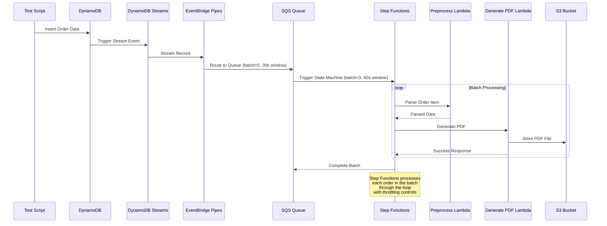

# Order PDF Generator Service

This is a **100% serverless** demonstration of PDF generation based on DynamoDB events through a Step Functions workflow. The service automatically generates professional PDF invoices when orders are inserted into DynamoDB.

## Architecture Overview

This serverless solution uses these AWS services:
- **AWS Lambda** - Serverless compute for PDF generation (Java 24)
- **AWS Step Functions** - Workflow orchestration with batch processing loop
- **AWS DynamoDB** - NoSQL database with streams
- **AWS SQS** - Message queuing service  
- **AWS EventBridge Pipes** - Event routing from streams to SQS with throttling
- **AWS S3** - Object storage for generated PDFs

### Technology Stack
- **Main Application**: Java 24 with Maven (Lambda functions, PDF generation)
- **Test Scripts**: TypeScript with Yarn (data generation and testing)
- **Infrastructure**: Pulumi with Java
- **PDF Generation**: HTML/CSS templates with OpenHTMLtoPDF

### Workflow Sequence



**Workflow Steps:**

1. **Test Script** inserts random order data into DynamoDB
2. **DynamoDB Streams** automatically capture the change events
3. **EventBridge Pipes** route stream records to SQS queue (throttled: 5 records/30s)
4. **SQS** triggers the Step Functions state machine (throttled: 3 messages/60s)
5. **Step Functions** orchestrates batch processing in a loop:
   - For each order item in the batch:
     - **Preprocess Lambda** parses and validates the order data
     - **Generate PDF Lambda** creates professional invoice PDFs using HTML/CSS templates
     - PDF is stored in **S3 bucket**
6. Step Functions completes the batch and acknowledges SQS

The Step Functions workflow processes multiple orders efficiently through its loop mechanism with built-in throttling controls.

## Deployment Commands

### Initial Setup

```bash
cd pulumi
pulumi stack init staging
pulumi config set tableName orders
pulumi config set bucketName order-pdf-generator-bucket-staging
pulumi config set aws:region af-south-1
pulumi up --yes   # Deploy infrastructure and Lambda functions
```

### Subsequent Deployments

```bash
cd pulumi
pulumi up --yes   # Deploy updates (automatically rebuilds JAR)
```

### Destroy Infrastructure

```bash
cd pulumi
pulumi destroy --yes   # Remove all AWS resources
```

## Development Setup

### Prerequisites
- **Node.js** and **Yarn** package manager
- **AWS CLI** configured with appropriate permissions
- **Java 24** and **Maven** for Lambda development

### Build & Deploy
```bash
# Build application
cd order-app
mvn clean package

# Deploy infrastructure (automatically builds and deploys JAR)
cd ../pulumi
pulumi up
```

## Testing

### Unit Tests
```bash
cd order-app
mvn test
```


### End-to-End Testing with Test Scripts
```bash
# Navigate to test scripts
cd TestScripts

# Install dependencies
yarn install

# Configure environment (optional - uses defaults)
cp .env.example .env
# Edit .env with your AWS configuration if needed

# Run test script to generate random orders (default: 100 orders)
yarn ts-node insert-test-orders.ts

# Generate specific number of orders
ORDER_COUNT=10 yarn ts-node insert-test-orders.ts

# Use different table name (default: orders-table)
DYNAMODB_TABLE_NAME=orders yarn ts-node insert-test-orders.ts

# Use different region (default: af-south-1)
AWS_REGION=us-east-1 yarn ts-node insert-test-orders.ts
```

### Test Script Features

The `insert-test-orders.ts` script generates realistic test data with:

**Data Generation:**
- **Random Order IDs**: Multiple patterns (ORD-timestamp-suffix, ORDER-datetime-suffix, WEB/APP/STORE-timestamp-suffix)
- **Customer Data**: 30 first names × 30 last names with 20 email domain variations
- **Product Names**: Combination of 10 categories × 10 adjectives × 26 product types
- **Addresses**: Realistic US addresses with 15 street names × 15 cities × 10 states
- **Phone Numbers**: US format with area codes (555, 444, 333, etc.)
- **Order Notes**: 10 realistic delivery instruction variations (70% probability)
- **Timestamps**: Random dates within last 30 days with precise timing

**Order Complexity:**
- **Items per Order**: 1-8 random items with unique product names
- **Pricing**: Realistic price variations (2.99-499.99) with quantity multipliers
- **Status Combinations**: Random order/PDF status combinations
- **Additional Records**: 2-4 additional state records per order (PAYMENT, SHIPPING, AUDIT)

**Database Structure:**
- **Main Order Record**: `pk: ORDER#orderId, sk: STATE#v1`
- **Item Records**: `pk: ORDER#orderId, sk: ITEM#001, ITEM#002, etc.`
- **State Records**: Various SKs for payment, shipping, audit trails
- **Rich Metadata**: Processing time, source, priority, region fields

**Sample Output:**
```
🚀 Starting Random DynamoDB Test Data Generation
============================================================
📋 Target table: orders-table
🌍 AWS Region: af-south-1
🔢 Generating 10 random orders

📝 Generating order 1/10...
   🎲 Generated: ORD-1755976358022-A7B3 for Sarah Martinez
   💰 Total: $156.47 (3 items)
✅ Inserted order ORD-1755976358022-A7B3 - Sarah Martinez ($156.47)
   📋 Added state record: PAYMENT#v1
   📋 Added state record: SHIPPING#v1
   📦 Added item ITEM-K7M2N9: Premium Electronics Headphones (Qty: 2)
   📦 Added item ITEM-P4R8T1: Smart Tech Mouse Pad (Qty: 1)
   📦 Added item ITEM-B9X5L3: Portable Office Charger (Qty: 1)
```

## Features

### PDF Generation
- **Professional Invoices**: HTML/CSS templates for high-quality PDFs
- **Dynamic Content**: Customer information, order details, line items
- **Responsive Layout**: Proper formatting for various content sizes
- **Template-Based**: Externalized HTML templates for easy customization

### Throttling & Flow Control
- **EventBridge Pipes Throttling**: Controls flow rate at source
- **Batch Processing**: Configurable batch sizes and windows
- **Sequential Processing**: Prevents overwhelming Lambda functions
- **Error Handling**: Built-in retry logic and dead letter queues

### Monitoring & Observability
- **CloudWatch Logs**: Comprehensive logging across all components
- **Step Functions Execution History**: Visual workflow monitoring
- **EventBridge Pipes Metrics**: Pipeline performance tracking
- **Lambda Metrics**: Function performance and error rates

## Project Structure

```
Order-PDF-Generator-Service/
├── README.md                          # This file
├── pulumi/                             # Infrastructure as Code (Pulumi Java)
│   ├── pom.xml
│   ├── src/main/java/com/orderpdf/infrastructure/
│   │   ├── PulumiStack.java           # Main stack definition
│   │   ├── lambda/LambdaComponent.java
│   │   ├── eventbridge/EventBridgePipesComponent.java
│   │   ├── stepfunctions/StepFunctionsComponent.java
│   │   └── roles/IAMRolesComponent.java
│   ├── Pulumi.yaml
│   └── Pulumi.staging.yaml
├── order-app/                         # Application code
│   ├── pom.xml
│   ├── src/main/java/com/orderpdf/app/
│   │   ├── preprocess/PreprocessHandler.java
│   │   ├── pdf/GeneratePdfHandler.java
│   │   ├── pdf/service/PdfDocumentGenerationService.java
│   │   ├── pdf/service/HtmlTemplateService.java
│   │   └── common/dto/...
│   └── src/main/resources/templates/
│       └── invoice-template.html       # PDF template
├── TestScripts/                       # Test data generation
│   ├── package.json
│   ├── insert-test-orders.ts          # Random order generator
│   └── README.md                      # Detailed testing guide
└── test/integration/                  # Integration tests
    ├── pom.xml
    └── src/test/java/com/orderpdf/it/
```

## Environment Variables

### Infrastructure Configuration
| Variable | Description | Default |
|----------|-------------|---------|
| `AWS_REGION` | AWS region for services | `af-south-1` |
| `BUCKET_NAME` | S3 bucket for PDFs | - |
| `REPROCESS_POLICY` | Order reprocessing policy | `FIRST_TIME_ONLY` |

### Test Script Configuration  
| Variable | Description | Default |
|----------|-------------|---------|
| `AWS_REGION` | AWS region for services | `af-south-1` |
| `DYNAMODB_TABLE_NAME` | DynamoDB table name | `orders-table` |
| `ORDER_COUNT` | Number of orders to generate | `100` |
| `AWS_ACCESS_KEY_ID` | AWS access key (optional) | - |
| `AWS_SECRET_ACCESS_KEY` | AWS secret key (optional) | - |

## Monitoring the Pipeline

Monitor each stage to verify the end-to-end workflow:

1. **DynamoDB**: Check the orders table for inserted records and verify stream activity
2. **EventBridge Pipes**: Monitor pipe execution logs in CloudWatch
3. **SQS**: Verify queue messages are being processed (should be empty after processing)
4. **Step Functions**: View state machine executions and success/failure rates
5. **Lambda Functions**: Check CloudWatch logs for both preprocess and PDF generation functions
6. **S3**: Verify generated PDF files appear in the output bucket

The entire workflow should complete within seconds for each order insertion, with throttling preventing system overload.

## Troubleshooting

### Common Issues

1. **KMS Access Denied**: Lambda execution roles include KMS decrypt permissions
2. **EventBridge Pipes Access**: Pipes role has DynamoDB stream and table permissions
3. **Concurrency Limits**: No reserved concurrency, uses natural throttling via pipes
4. **PDF Generation**: Uses HTML/CSS templates with OpenHTMLtoPDF for reliable rendering

### Required AWS Permissions

Your deployment credentials need:
- Full access to Lambda, Step Functions, DynamoDB, SQS, EventBridge, S3
- IAM role creation and policy attachment
- CloudWatch Logs access

## License

This project is a demonstration of serverless PDF generation using AWS services.